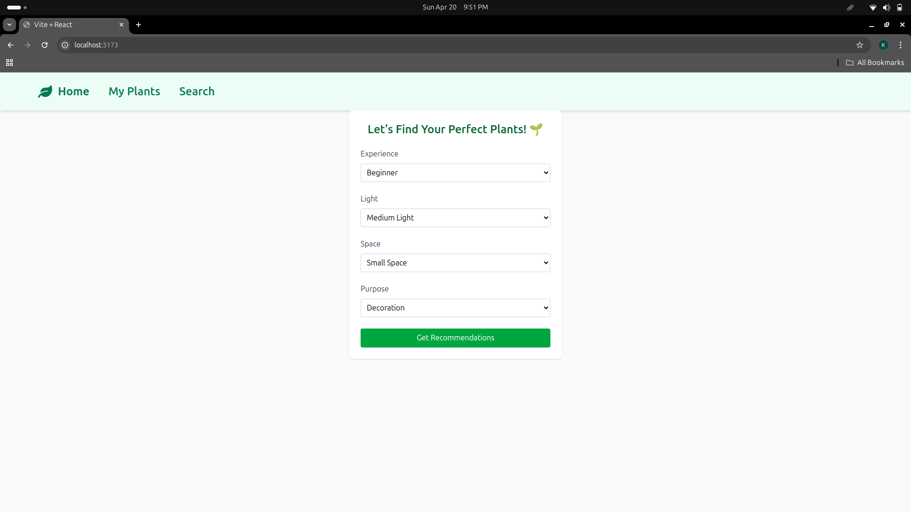
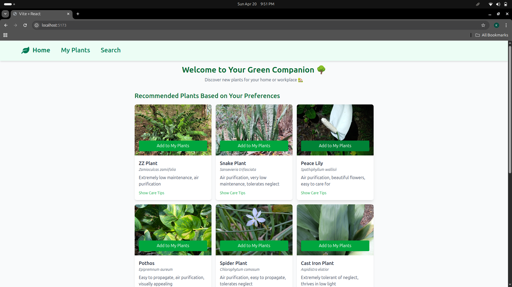
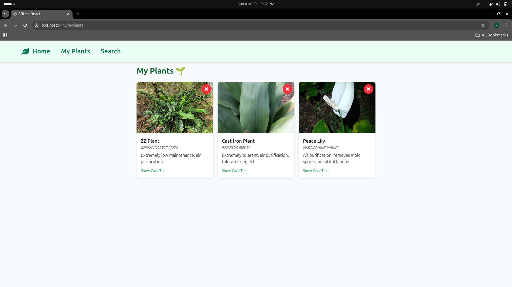
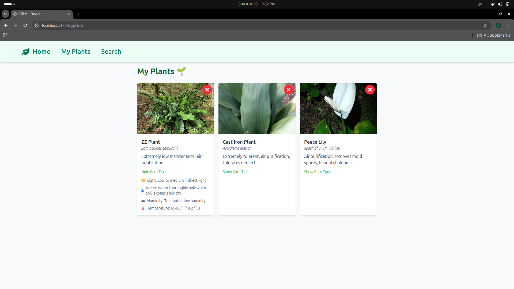
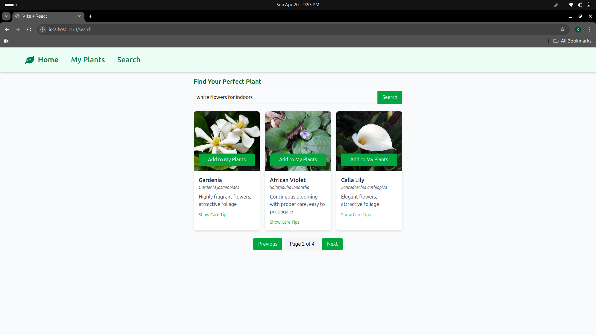

# 🌱 Plant Recommender

## Description
This is a React-based web application that helps users discover indoor plants for their homes and workspaces. The app uses Google's Gemini API to provide personalized plant recommendations based on user preferences and existing plant collections. Users can search for plants, save their favorites, and get detailed care instructions.

##Live Link
https://plant-recommendation-system-50k4yxrhe-kavya-dhyanis-projects.vercel.app/

## Features

### 1. Personalized Plant Recommendations
- Get plant suggestions based on your experience level and preferences
- Recommendations update based on your saved plants
- Uses Gemini API for intelligent plant matching and inaturalist API for images

```jsx
const fetchRecommendations = useCallback(async () => {
  const randomPlant = savedPlants[Math.floor(Math.random() * savedPlants.length)];
  const prompt = `Suggest 5 indoor plants similar to ${randomPlant.scientificName}...`;
  
  const response = await axios.post(
    'https://generativelanguage.googleapis.com/v1beta/models/gemini-2.0-flash:generateContent',
    {
      contents: [{
        parts: [{ text: prompt }]
      }]
    },
    {
      params: { key: API_KEY },
      headers: { 'Content-Type': 'application/json' }
    }
  );
});
```

### 2. Plant Search
- Natural language search for plants
- Filter results based on care requirements
- Save plants to your collection

```jsx
const handleSearch = async (e) => {
  e.preventDefault();
  const prompt = `Find indoor plants that match: "${searchQuery}"...`;
  
  const response = await axios.post(
    'https://generativelanguage.googleapis.com/v1beta/models/gemini-2.0-flash:generateContent',
    {
      contents: [{
        parts: [{ text: prompt }]
      }]
    },
    {
      params: { key: API_KEY },
      headers: { 'Content-Type': 'application/json' }
    }
  );
};
```

### 3. Plant Collection Management
- Save and organize your favorite plants
- View detailed care instructions
- Remove plants from your collection

### 4. Care Tips Display
- Interactive care instructions
- Light, water, and humidity requirements
- Temperature preferences

### 5. Performance Optimizations
- Lazy loading for images
- Memoized components
- Optimized state management

## Tech Stack

- **Frontend Framework**: React.js
- **Styling**: Tailwind CSS
- **State Management**: React Context API
- **API Integration**: Google Gemini API
- **Build Tool**: Vite
- **HTTP Client**: Axios

## Setup Instructions

1. Clone the repository:
```bash
git clone https://github.com/yourusername/plant-recommender.git
cd plant-recommender
```

2. Install dependencies:
```bash
npm install
```

3. Create a `.env` file in the root directory:
```env
VITE_GEMINI_API_KEY=your_gemini_api_key_here
```

4. Start the development server:
```bash
npm run dev
```

5. Open your browser and navigate to `http://localhost:5173`

### Environment Variables
- `VITE_GEMINI_API_KEY`: Your Google Gemini API key
  - Get your API key from [Google AI Studio](https://makersuite.google.com/app/apikey)
  - Add it to the `.env` file
  - Make sure to add `.env` to your `.gitignore`

### Project Structure
```
plant-recommender/
├── src/
│   ├── components/
│   │   ├── Home.jsx           # Main landing page
│   │   ├── PlantCard.jsx      # Plant display component
│   │   ├── FirstTimeForm.jsx  # User preferences form
│   │   ├── MyPlants.jsx       # Plant collection
│   │   ├── Search.jsx         # Search functionality
│   │   └── Navbar.jsx         # Navigation
│   ├── context/
│   │   └── PlantContext.jsx   # Global state
│   ├── utils/
│   │   └── plantUtils.jsx     # Helper functions
│   └── App.jsx                # Root component
```

## Screenshots

### First Time Form

*User preferences form for personalized recommendations*

### Home Page

*The main landing page showing personalized plant recommendations based on user preferences*

### Plant Collection

*User's saved plant collection with care instructions. The cards can be clicked for google search*

### Plant Details

*Detailed view of a plant with care tips and add/remove functionality*

### Search Functionality

*Natural language search interface for finding specific plants*


